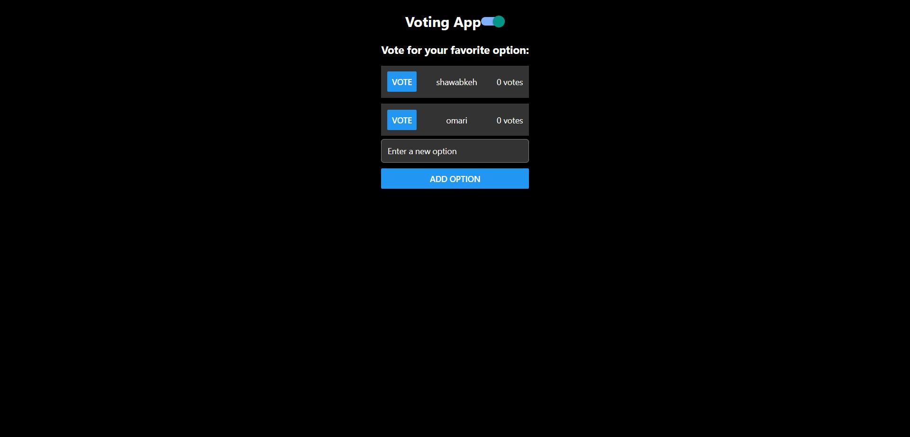
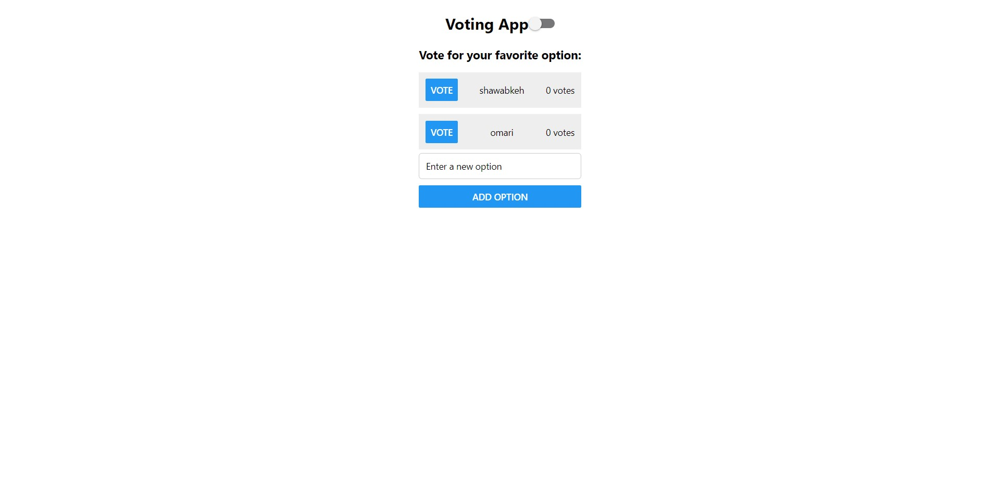

# Voting App

The Voting App is a simple mobile application that allows users to create and participate in polls or voting sessions. It offers a user-friendly interface for creating and managing voting options and displays results in real-time.

## Features

### 1. Create and Manage Voting Options
- Users can easily create new voting options by entering text in the provided input field.
- Options can be added to the list, allowing users to customize the voting choices.
- Options are displayed with a vote count, and users can vote for their favorite choice.

### 2. Real-time Voting Results
- As users cast their votes, the app keeps track of the total votes for each option and updates the results in real-time.
- The results are presented as a percentage of total votes for each option.

### 3. Dark Mode Support
- The app features a dark mode that enhances visibility and reduces eye strain in low-light environments.
- Users can switch between light and dark modes using the toggle switch provided in the header.

### Photos : 

